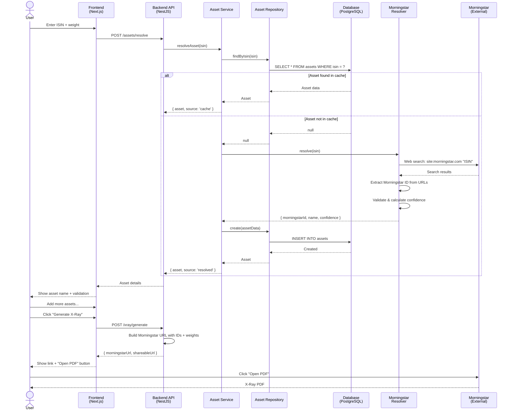
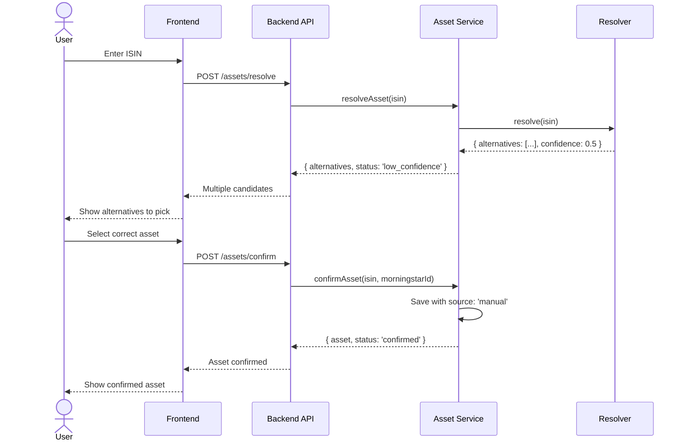
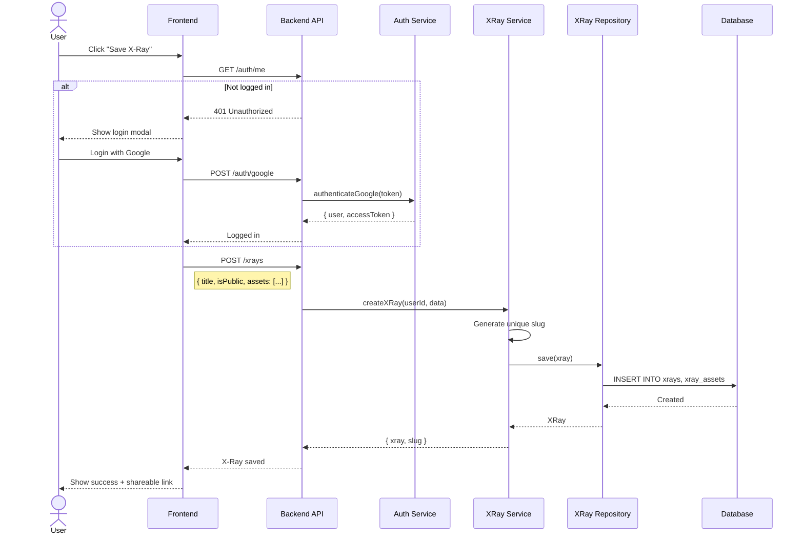
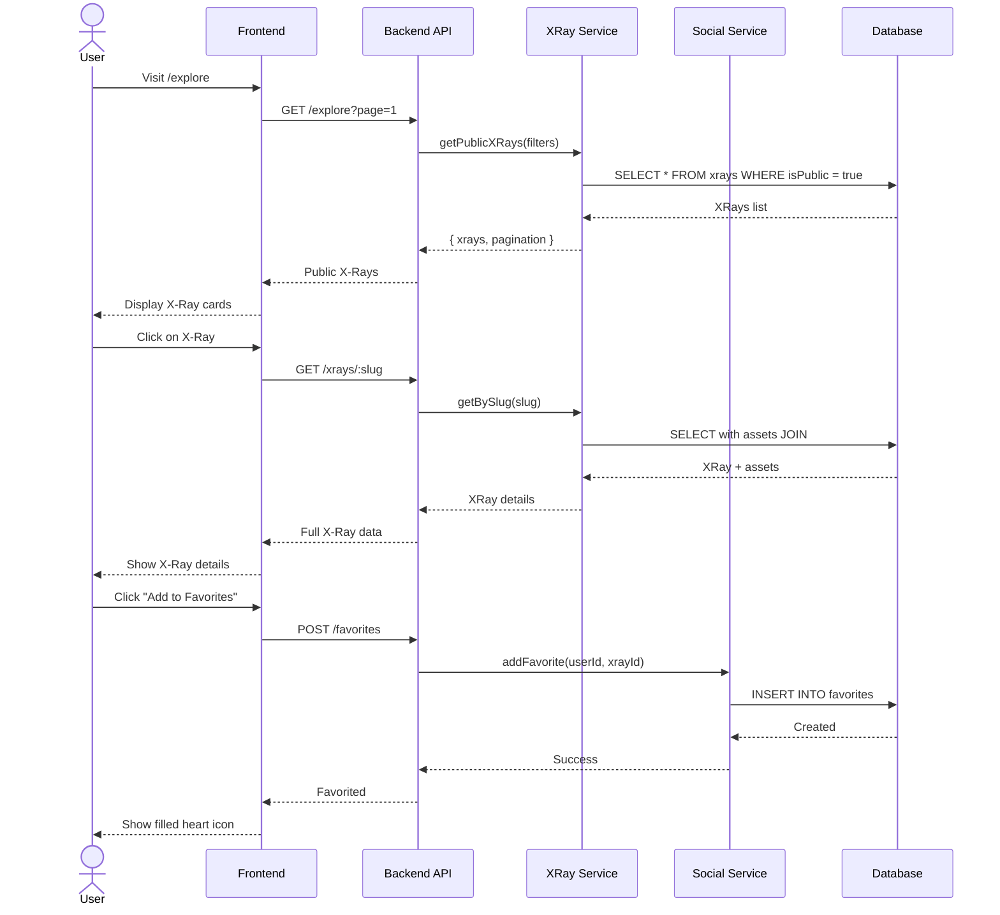
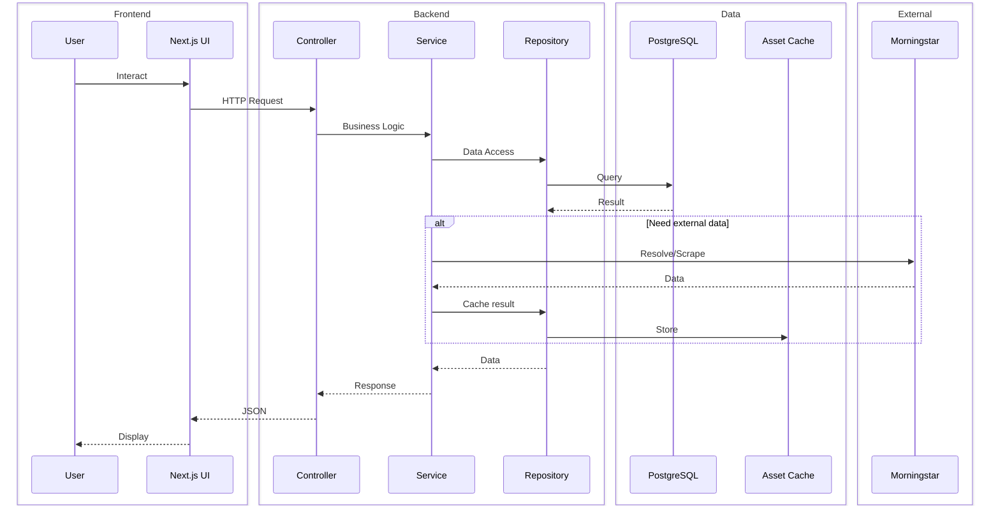

# Portfolio X-Ray Generator — Sequence Diagrams

## V1: Generate X-Ray Flow

---

## V1: Low Confidence Resolution Flow

---

## V2: Save X-Ray Flow

---

## V3: Explore & Favorite Flow

---

## Component Interaction Overview

